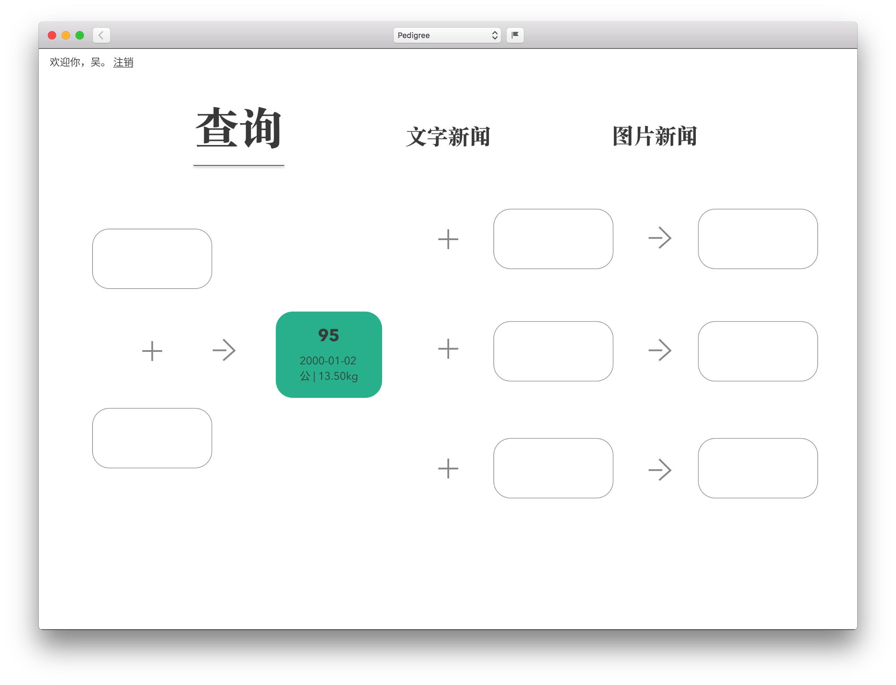

# Introduction
### 展示

**管理员查询页**

**谱系图展示**

### 项目结构（Java）

* src/main/java
	* config - 存储 Neo4j 数据库配置信息
	* controller
		* filter
		* servlet
			* cattle
			* navigation 首页导航
			* user - 登录控制
	* model - 定义实体的 POJO 类
	* service - 数据库交互的接口
		* impl - 接口的实现类
	* util - OGM 单例

### Graph Database
相对于传统关系型数据库（Relational Database）以表的形式存储所有数据实体，图数据库用直观易于理解的方式将数据实体存储到一个个的节点（Node）中，关系（Relationship）则由节点所连接。

### OGM (Object-Graph Mapping)
Neo4j 对 OGM 的定义：
> An OGM (Object Graph Mapper) maps nodes and relationships in the graph to objects and references in a domain model. Object instances are mapped to nodes while object references are mapped using relationships, or serialized to properties (e.g. references to a Date). JVM primitives are mapped to node or relationship properties. An OGM abstracts the database and provides a convenient way to persist your domain model in the graph and query it without using low level drivers. It also provides the flexibility to the developer to supply custom queries where the queries generated by the OGM are insufficient.

试转译：
> OGM (Object Graph Mapper) 是一种匹配器，它将图中的 nodes 和 relationships 匹配到域模型中的一个个对象。OGM 把数据库抽象出来，提供一个方便的方式去交互处理图中的对象，并能在不使用底层的数据库连接驱动的情况下进行查询。当 OGM 生成的查询不能满足需要的时候，它也具有添加自定义查询的灵活性。
>
> Neo4j-OGM 是一个 Java 库，使用它能通过标注了的域模型（POJO 类）建立与数据库的匹配。在 OGM 的支持下，连接数据库进行更新的次数得到了最小化。

对数据库的操作简化为了对 Java 对象的操作，提交更改的过程则隐藏到了 session 之后。

而至于 session 是什么，文档中又是这样说的：
> The Session keeps track of changes made to entities and relationships and persists ones that have been modified on save. Once an entity is tracked by the session, reloading this entity within the scope of the same session will result in the session cache returning the previously loaded entity. However, the subgraph in the session will expand if the entity or its related entities retrieve additional relationships from the graph.

转译如下：
> 一个 session 中存有实体和关系的变更信息，一旦一个实体被一个 session 追踪了，如果在同一个 session 的作用域中重复加载该实体，将直接从 session 缓存的这部分子图中获得。如果数据库中的图的相关实体有新增加的关系，session 子图则会扩增。

如果想要从数据库获取最新的数据，可以创建一个新的 session，或者用 Session.clear() 清空。Session 的生命周期可以通过编写代码来控制，太长或者太短都不好。

对 OGM 大致实现步骤的总结：
1. 在构建工具中添加 ogm 依赖；
2. 连接到数据库；
3. 构建域模型，这是匹配数据库对象到 Java 对象的关键；
4. 实现一个单例模式，提供创建 session 的接口；
5. 使用 Service 结构，定义与数据库交互的接口，以及实现类。

更多参考 Neo4j 的官方文档：https://neo4j.com/docs/ogm-manual/current/introduction/

---

#### To-dos
- QueryCattleServlet 中的 `getRequestDispatcher("PATH").forward()` 无效。

#### 一些细节
- `SessionFactory` 的实例需要手动关闭（`close()`），否则会在关闭程序时出现线程错误。