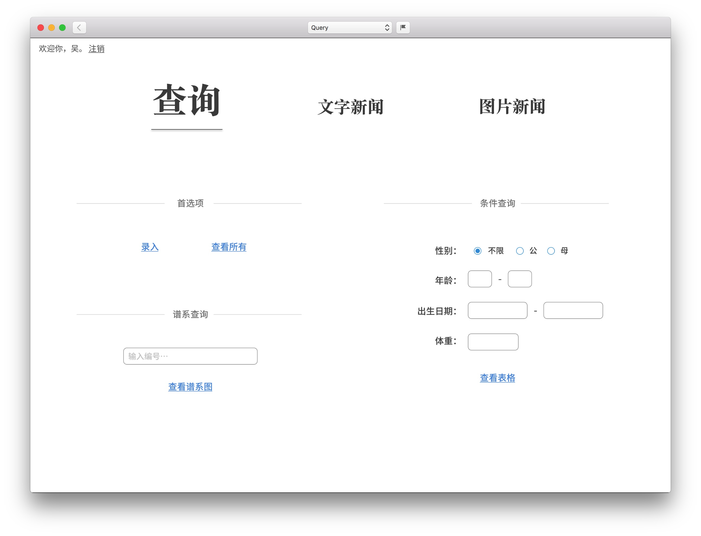

# Introduction
### 展示

**管理员查询页**

**谱系图展示**

### 项目结构（Java）

* src/main/java
	* config - 存储 Neo4j 数据库配置信息
	* controller
		* filter
		* servlet
			* cattle
			* navigation 首页导航
			* user - 登录控制
	* model - 定义实体的 POJO 类
	* service - 数据库交互的接口
		* impl - 接口的实现类
	* util - OGM 单例

### Graph Database
相对于传统关系型数据库（Relational Database）以表的形式存储所有数据实体，图数据库用直观易于理解的方式将数据实体存储到一个个的节点（Node）中，关系（Relationship）则由节点所连接。

### OGM (Object-Graph Mapping)
Neo4j 提供了很好的对 OGM 的支持，把对数据库的操作简化为了对 Java 对象的操作，把提交更改的过程隐藏到了 session 之后。大致的步骤是：
1. 在构件工具中添加 ogm 依赖；
2. 连接到数据库；
3. 构建域模型，这是匹配数据库对象到 Java 对象的关键；
4. 实现一个单例模式，提供创建 session 的接口；
5. 使用 Service 结构，定义与数据库交互的接口，以及实现类。

更多参考 Neo4j 的官方文档：https://neo4j.com/docs/ogm-manual/current/introduction/